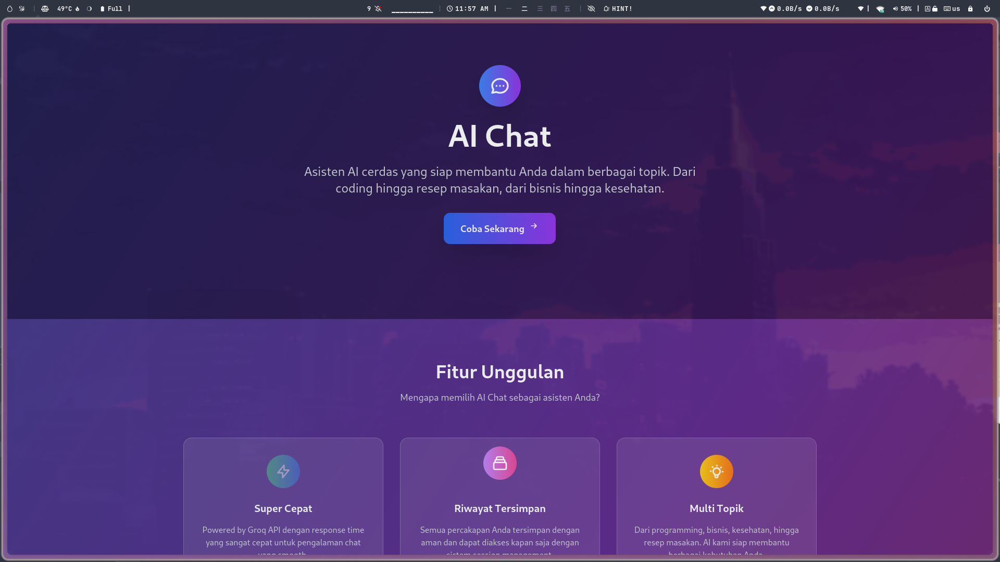
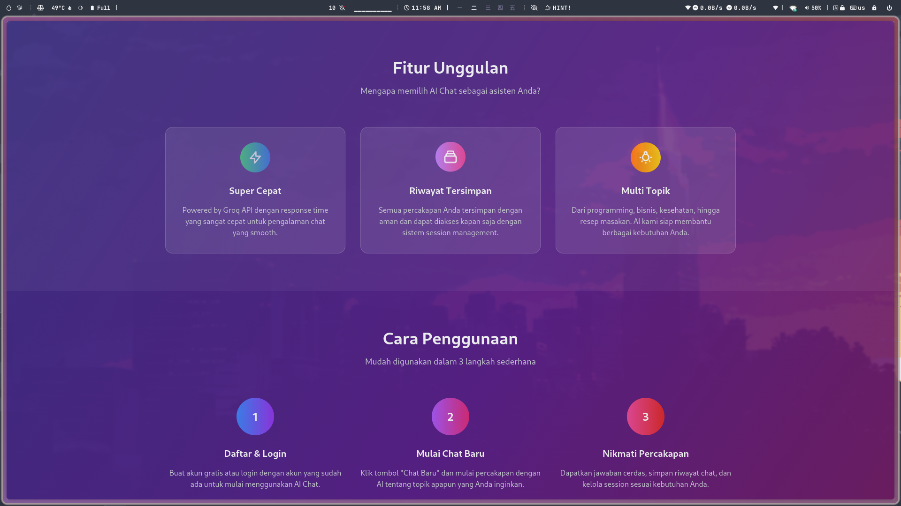
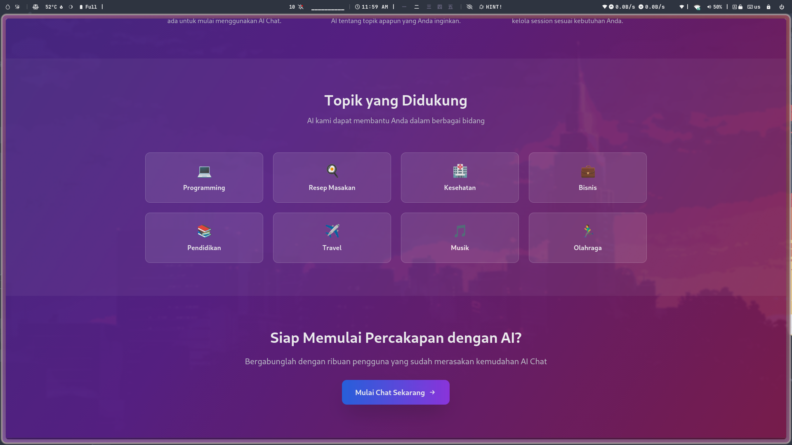
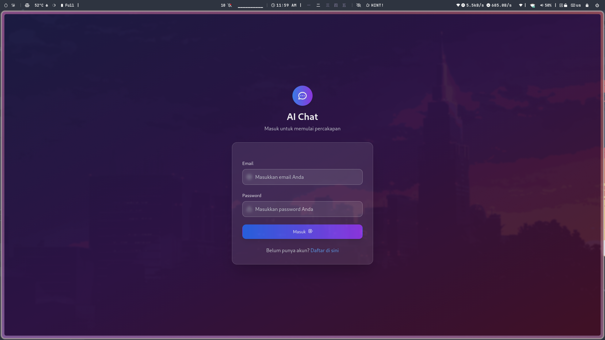
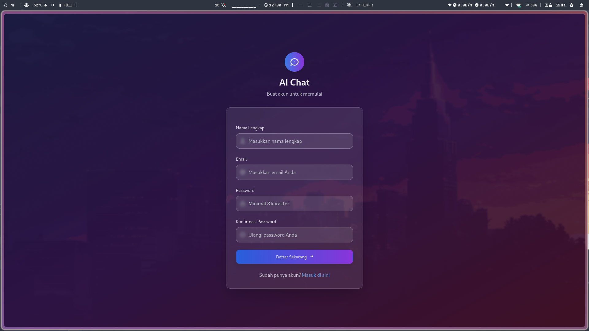
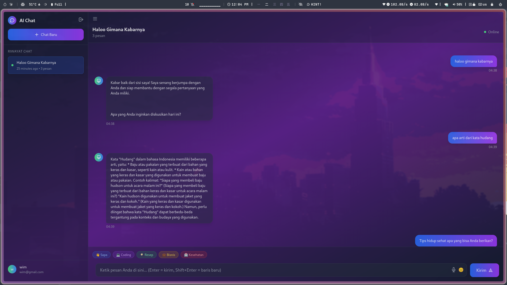
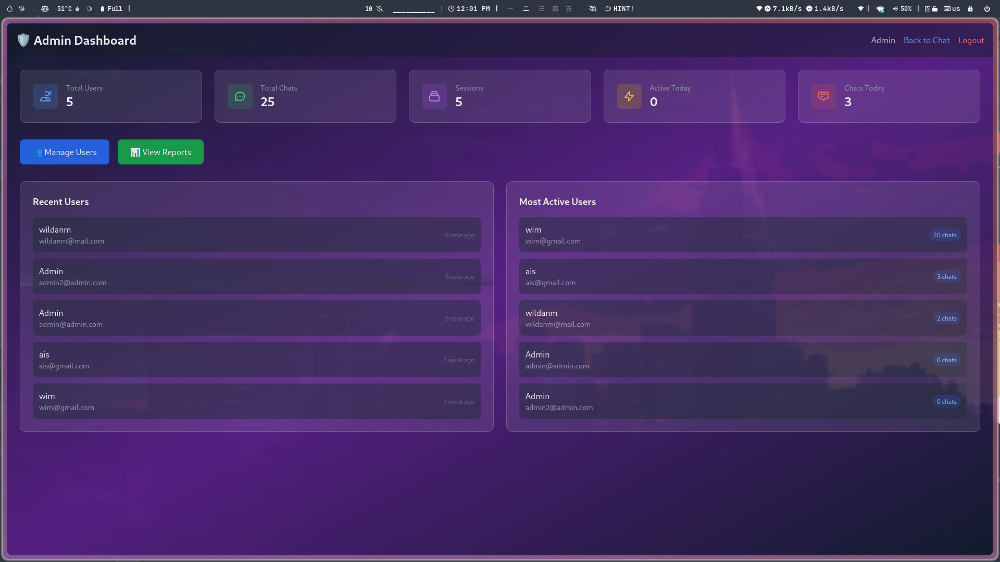
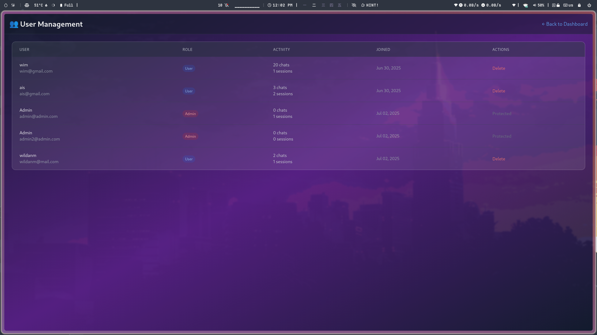
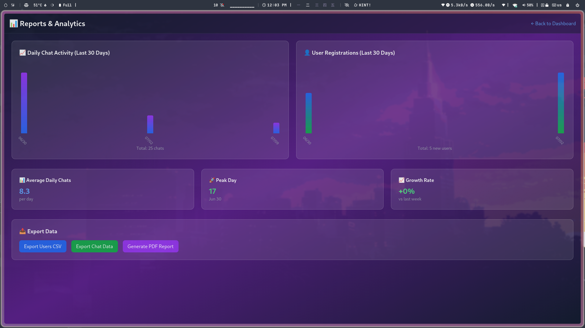

# 📊 LAPORAN PENGEMBANGAN APLIKASI AI CHAT

<div align="center">
  
  
  
  
</div>

<div align="center">
  <h3>🚀 Aplikasi Chat AI Modern dengan Laravel</h3>
  <p>Asisten AI cerdas yang siap membantu Anda dalam berbagai topik - dari coding hingga resep masakan!</p>
</div>

---

## 📑 DAFTAR ISI

1. [Pendahuluan](#-pendahuluan)
2. [Struktur Database](#-struktur-database)
3. [Struktur UI/UX](#-struktur-uiux)
4. [Struktur Kode](#-struktur-kode)
5. [Fitur Aplikasi](#-fitur-aplikasi)
6. [Skenario Penggunaan](#-skenario-penggunaan)
7. [Kesimpulan](#-kesimpulan)

---

## 📝 PENDAHULUAN

Aplikasi AI Chat adalah platform berbasis web yang memungkinkan pengguna untuk berinteraksi dengan asisten AI cerdas. Aplikasi ini dikembangkan menggunakan framework Laravel dengan tampilan modern menggunakan Tailwind CSS. Aplikasi ini memiliki dua jenis pengguna: user biasa dan admin. User biasa dapat melakukan chat dengan AI, sedangkan admin memiliki akses ke dashboard admin untuk mengelola pengguna dan melihat laporan.

### 🎯 Tujuan Pengembangan

1. Membuat aplikasi chat AI yang mudah digunakan
2. Menyediakan antarmuka yang responsif dan modern
3. Mengimplementasikan sistem autentikasi yang aman
4. Menyediakan panel admin untuk manajemen pengguna dan laporan
5. Mengintegrasikan dengan berbagai API AI untuk respons yang cerdas

### 🛠️ Teknologi yang Digunakan

- **Backend**: Laravel 11, PHP 8.1+
- **Frontend**: Tailwind CSS, Vanilla JavaScript
- **Database**: SQLite
- **AI Integration**: Groq API (Llama3-8B), Cohere, Hugging Face
- **Authentication**: Laravel built-in authentication

---

## 📊 STRUKTUR DATABASE

### 📋 Diagram Relasi Entitas (ERD)

```
+---------------+       +----------------+       +-------------+
|     User      |       |  ChatSession   |       |    Chat     |
+---------------+       +----------------+       +-------------+
| id            |<----->| id             |<----->| id          |
| name          |       | user_id        |       | user_id     |
| email         |       | title          |       | session_id  |
| password      |       | created_at     |       | message     |
| role          |       | updated_at     |       | response    |
| created_at    |       +----------------+       | created_at  |
| updated_at    |                                | updated_at  |
+---------------+                                +-------------+
```

### 📝 Kamus Data

#### 1. Tabel `users`

| Field            | Tipe Data      | Keterangan                                      |
|------------------|----------------|------------------------------------------------|
| id               | bigint         | Primary key, auto-increment                     |
| name             | varchar(255)   | Nama pengguna                                   |
| email            | varchar(255)   | Email pengguna (unique)                         |
| email_verified_at| timestamp      | Waktu verifikasi email (nullable)               |
| password         | varchar(255)   | Password terenkripsi                            |
| role             | varchar(255)   | Role pengguna ('user' atau 'admin')             |
| remember_token   | varchar(100)   | Token untuk fitur "remember me" (nullable)      |
| created_at       | timestamp      | Waktu pembuatan record                          |
| updated_at       | timestamp      | Waktu update terakhir record                    |

#### 2. Tabel `chat_sessions`

| Field            | Tipe Data      | Keterangan                                      |
|------------------|----------------|------------------------------------------------|
| id               | bigint         | Primary key, auto-increment                     |
| user_id          | bigint         | Foreign key ke tabel users                      |
| title            | varchar(255)   | Judul sesi chat                                 |
| created_at       | timestamp      | Waktu pembuatan record                          |
| updated_at       | timestamp      | Waktu update terakhir record                    |

#### 3. Tabel `chats`

| Field            | Tipe Data      | Keterangan                                      |
|------------------|----------------|------------------------------------------------|
| id               | bigint         | Primary key, auto-increment                     |
| user_id          | bigint         | Foreign key ke tabel users                      |
| session_id       | bigint         | Foreign key ke tabel chat_sessions (nullable)   |
| message          | text           | Pesan dari pengguna                             |
| response         | text           | Respons dari AI                                 |
| created_at       | timestamp      | Waktu pembuatan record                          |
| updated_at       | timestamp      | Waktu update terakhir record                    |

### 🔄 Relasi Antar Tabel

1. **User - ChatSession**: One-to-Many
   - Satu user dapat memiliki banyak sesi chat
   - Relasi: `User.id` → `ChatSession.user_id`

2. **User - Chat**: One-to-Many
   - Satu user dapat memiliki banyak chat
   - Relasi: `User.id` → `Chat.user_id`

3. **ChatSession - Chat**: One-to-Many
   - Satu sesi chat dapat memiliki banyak chat
   - Relasi: `ChatSession.id` → `Chat.session_id`

### 📦 Migrasi Database

Aplikasi menggunakan migrasi Laravel untuk membuat dan memodifikasi struktur database:

1. `0001_01_01_000000_create_users_table.php` - Membuat tabel users
2. `2025_06_30_140720_create_chats_table.php` - Membuat tabel chats
3. `2025_06_30_144852_create_chat_sessions_table.php` - Membuat tabel chat_sessions
4. `2025_06_30_145032_add_session_id_to_chats_table.php` - Menambahkan kolom session_id ke tabel chats
5. `2025_07_02_064615_add_role_to_users_table.php` - Menambahkan kolom role ke tabel users

---

## 🎨 STRUKTUR UI/UX

### 🏠 Halaman Welcome



**Deskripsi**: Halaman landing page yang menampilkan informasi tentang aplikasi AI Chat. Halaman ini menampilkan fitur-fitur utama aplikasi, cara penggunaan, dan topik yang didukung.

**Elemen UI**:
- Hero section dengan judul dan deskripsi
- CTA button "Coba Sekarang"
- Fitur unggulan dengan ikon dan deskripsi
- Cara penggunaan dengan langkah-langkah
- Topik yang didukung dengan grid layout
- Footer dengan informasi kontak

**Interaksi**:
- Klik "Coba Sekarang" → Redirect ke halaman login
- Hover pada cards → Efek scale dan shadow
- Animasi pada ikon dan elemen visual



**Fitur Tambahan**:
- Animasi pada ikon fitur
- Hover effects pada cards
- Responsive design untuk mobile dan desktop



**Topik yang Didukung**:
- Programming & Coding
- Resep & Masakan
- Kesehatan
- Bisnis & Marketing
- Pendidikan
- Travel & Wisata
- Musik
- Olahraga & Fitness

### 🔐 Halaman Login & Register



**Deskripsi**: Halaman login untuk pengguna yang sudah terdaftar.

**Elemen UI**:
- Form login dengan email dan password
- Remember me checkbox
- Link ke halaman register
- Validasi form

**Interaksi**:
- Submit form → Login dan redirect ke chat (user) atau dashboard (admin)
- Klik "Register" → Redirect ke halaman register



**Deskripsi**: Halaman register untuk pengguna baru.

**Elemen UI**:
- Form register dengan nama, email, password, dan konfirmasi password
- Link ke halaman login
- Validasi form

**Interaksi**:
- Submit form → Register, login otomatis, dan redirect ke chat

### 💬 Halaman Chat



**Deskripsi**: Halaman utama untuk berinteraksi dengan AI. Pengguna dapat mengirim pesan dan menerima respons dari AI.

**Elemen UI**:
- Sidebar dengan daftar sesi chat
- Header dengan judul sesi chat
- Area chat dengan pesan pengguna dan respons AI
- Input pesan dengan tombol kirim
- Quick actions untuk topik populer
- Emoji picker
- Copy button untuk respons AI

**Interaksi**:
- Kirim pesan → Tampilkan typing indicator → Tampilkan respons AI
- Klik sesi chat di sidebar → Load chat dari sesi tersebut
- Klik "Chat Baru" → Buat sesi chat baru
- Klik tombol delete → Hapus sesi chat
- Klik tombol copy → Copy respons AI ke clipboard
- Klik emoji → Insert emoji ke input pesan
- Klik quick action → Auto-fill input pesan
- Enter → Kirim pesan
- Shift+Enter → New line di input pesan
- Toggle sidebar → Sembunyikan/tampilkan sidebar

**Fitur Interaktif**:
- Auto-resize textarea
- Typing indicator saat AI merespons
- Sound effects untuk interaksi
- Hover effects pada chat bubbles
- Format respons AI dengan bullet points dan bold text

### 🛡️ Halaman Admin Dashboard



**Deskripsi**: Dashboard untuk admin yang menampilkan statistik dan overview aplikasi.

**Elemen UI**:
- Header dengan judul dan navigasi
- Statistik cards (total users, chats, sessions, dll)
- Recent users list
- Top users list
- Navigation buttons ke halaman lain

**Interaksi**:
- Klik "Manage Users" → Redirect ke halaman users
- Klik "View Reports" → Redirect ke halaman reports
- Klik "Back to Chat" → Redirect ke halaman chat

### 👥 Halaman Manage Users



**Deskripsi**: Halaman untuk mengelola pengguna aplikasi.

**Elemen UI**:
- Tabel users dengan informasi (nama, email, role, aktivitas)
- Pagination
- Action buttons (delete)
- Status badges untuk role

**Interaksi**:
- Klik "Delete" → Konfirmasi → Hapus user
- Klik pagination → Navigate ke halaman lain
- Klik "Back to Dashboard" → Redirect ke dashboard

### 📈 Halaman Reports



**Deskripsi**: Halaman untuk melihat laporan dan analitik aplikasi.

**Elemen UI**:
- Charts untuk aktivitas chat dan registrasi user
- Summary stats (average daily chats, peak day, growth rate)
- Export options

**Interaksi**:
- Hover pada chart bars → Tampilkan tooltip dengan detail
- Klik export buttons → Download data dalam format yang dipilih
- Klik "Back to Dashboard" → Redirect ke dashboard

---

## 🧩 STRUKTUR KODE

### 📁 Struktur Folder

```
deepsea/
├── 🎨 resources/views/
│   ├── welcome.blade.php      # Landing page
│   ├── auth/                  # Login & Register
│   │   ├── login.blade.php
│   │   └── register.blade.php
│   ├── chat/                  # Chat interface
│   │   └── index.blade.php
│   ├── admin/                 # Admin panel
│   │   ├── dashboard.blade.php
│   │   ├── users.blade.php
│   │   └── reports.blade.php
│   └── layouts/               # Layout templates
│       └── app.blade.php
├── 🔧 app/
│   ├── Models/                # Database models
│   │   ├── User.php
│   │   ├── Chat.php
│   │   └── ChatSession.php
│   └── Http/Controllers/      # Controllers
│       ├── AuthController.php
│       ├── ChatController.php
│       └── AdminController.php
├── 🗄️ database/
│   └── migrations/            # Database migrations
└── 🌐 routes/
    └── web.php               # Application routes
```

### 🧠 Models

#### User Model

```php
class User extends Authenticatable
{
    use HasFactory, Notifiable;

    protected $fillable = [
        'name',
        'email',
        'password',
    ];

    protected $hidden = [
        'password',
        'remember_token',
    ];

    protected function casts(): array
    {
        return [
            'email_verified_at' => 'datetime',
            'password' => 'hashed',
        ];
    }

    public function chats(): HasMany
    {
        return $this->hasMany(Chat::class);
    }

    public function chatSessions(): HasMany
    {
        return $this->hasMany(ChatSession::class);
    }
}
```

#### Chat Model

```php
class Chat extends Model
{
    protected $fillable = ['user_id', 'session_id', 'message', 'response'];

    public function user(): BelongsTo
    {
        return $this->belongsTo(User::class);
    }

    public function session(): BelongsTo
    {
        return $this->belongsTo(ChatSession::class, 'session_id');
    }
}
```

#### ChatSession Model

```php
class ChatSession extends Model
{
    protected $fillable = ['user_id', 'title'];

    public function user(): BelongsTo
    {
        return $this->belongsTo(User::class);
    }

    public function chats(): HasMany
    {
        return $this->hasMany(Chat::class, 'session_id');
    }
}
```

### 🎮 Controllers

#### AuthController

Menangani autentikasi pengguna (login, register, logout).

**Fitur Utama**:
- Login dengan validasi
- Register dengan validasi
- Logout
- Redirect berdasarkan role (admin/user)

#### ChatController

Menangani interaksi chat antara pengguna dan AI.

**Fitur Utama**:
- Menampilkan halaman chat
- Mengirim pesan ke AI dan menerima respons
- Membuat sesi chat baru
- Menghapus sesi chat
- Format respons AI (bullet points, bold text)
- Generate judul chat berdasarkan topik

#### AdminController

Menangani fitur-fitur admin.

**Fitur Utama**:
- Menampilkan dashboard admin dengan statistik
- Menampilkan dan mengelola daftar pengguna
- Menampilkan laporan dan analitik
- Middleware untuk membatasi akses hanya untuk admin

### 🌐 Routes

```php
// Welcome page
Route::get('/', function () {
    if (auth()->check()) {
        $user = auth()->user();
        if ($user->role === 'admin') {
            return redirect('/admin/dashboard');
        }
        return redirect('/chat');
    }
    return view('welcome');
})->name('welcome');

// Auth routes
Route::get('/login', [AuthController::class, 'showLogin'])->name('login');
Route::post('/login', [AuthController::class, 'login']);
Route::get('/register', [AuthController::class, 'showRegister'])->name('register');
Route::post('/register', [AuthController::class, 'register']);
Route::post('/logout', [AuthController::class, 'logout'])->name('logout');

// Protected routes
Route::middleware('auth')->group(function () {
    Route::get('/chat', [ChatController::class, 'index'])->name('chat.index');
    Route::post('/chat/send', [ChatController::class, 'send'])->name('chat.send');
    Route::post('/chat/new-session', [ChatController::class, 'newSession'])->name('chat.new-session');
    Route::delete('/chat/session/{id}', [ChatController::class, 'deleteSession'])->name('chat.delete-session');
    
    // Admin routes
    Route::prefix('admin')->name('admin.')->group(function () {
        Route::get('dashboard', [AdminController::class, 'dashboard'])->name('dashboard');
        Route::get('users', [AdminController::class, 'users'])->name('users');
        Route::delete('users/{id}', [AdminController::class, 'deleteUser'])->name('users.delete');
        Route::get('reports', [AdminController::class, 'reports'])->name('reports');
    });
});
```

---

## ✨ FITUR APLIKASI

### 🎯 Core Features

#### 🔐 Authentication System
- Login & Register yang aman
- Password hashing
- Remember me functionality
- Role-based access control (admin/user)

#### 💬 Real-time Chat
- Percakapan langsung dengan AI
- Typing indicator
- Sound effects
- Copy response functionality
- Format respons dengan bullet points dan bold text

#### 📚 Session Management
- Multiple chat sessions
- Auto-generate judul berdasarkan topik
- Delete sessions
- Switch antar sessions

#### 💾 Auto-save History
- Riwayat chat tersimpan otomatis
- Timestamp untuk setiap pesan
- Persistent storage di database

#### 🏷️ Smart Titles
- Auto-generate judul berdasarkan topik
- Emoji untuk setiap kategori topik
- Deteksi topik berdasarkan kata kunci

### 🤖 AI Integration

#### ⚡ Groq API
- Response super cepat dengan Llama3-8B
- System prompt untuk format yang konsisten
- Handling error dan fallback

#### 🔄 Multiple Providers
- Fallback ke Cohere, Hugging Face
- Graceful degradation
- Error handling

#### 🎨 Smart Formatting
- Response AI dengan bullet points
- Bold text formatting
- Code block formatting
- Proper line breaks

#### 🧠 Context Aware
- Memahami berbagai topik percakapan
- Deteksi topik untuk judul
- Format respons berdasarkan konten

### 🎨 UI/UX Excellence

#### 🌙 Dark Theme
- Design modern dengan gradient
- Glassmorphism effect
- Consistent color scheme

#### 📱 Responsive
- Perfect di desktop dan mobile
- Collapsible sidebar
- Adaptive layout

#### ✨ Glassmorphism
- Efek blur dan transparansi
- Modern card design
- Subtle shadows

#### 🎭 Smooth Animations
- Transisi yang halus
- Hover effects
- Loading states

### 👑 Admin Features

#### 📊 Dashboard
- Overview statistik
- Recent users
- Top users
- Quick navigation

#### 👥 User Management
- List semua users
- User details
- Delete functionality
- Activity tracking

#### 📈 Reports & Analytics
- Daily chat activity chart
- User registration chart
- Summary statistics
- Growth metrics

---

## 🎬 SKENARIO PENGGUNAAN

### 👤 User Journey

#### 1. Pengunjung Baru

**Skenario**: Pengunjung pertama kali mengakses aplikasi

1. Pengunjung membuka website dan melihat landing page
2. Pengunjung membaca informasi tentang fitur aplikasi
3. Pengunjung mengklik tombol "Coba Sekarang"
4. Pengunjung diarahkan ke halaman register
5. Pengunjung mengisi form register dan submit
6. Sistem membuat akun baru dan login otomatis
7. Pengunjung diarahkan ke halaman chat

**Output**: Akun baru terdaftar dan user masuk ke halaman chat

#### 2. User Login dan Chat

**Skenario**: User yang sudah terdaftar ingin chat dengan AI

1. User membuka website dan mengklik "Login"
2. User mengisi email dan password
3. Sistem memverifikasi kredensial dan login
4. User diarahkan ke halaman chat
5. User melihat sesi chat sebelumnya di sidebar
6. User mengklik "Chat Baru" untuk memulai percakapan baru
7. User mengetik pesan dan menekan Enter
8. Sistem menampilkan typing indicator
9. AI memproses pesan dan mengirim respons
10. User menerima respons dan melanjutkan percakapan

**Output**: Percakapan baru tersimpan dengan judul otomatis

#### 3. User Mengelola Sesi Chat

**Skenario**: User ingin mengelola sesi chat yang ada

1. User login dan masuk ke halaman chat
2. User melihat daftar sesi chat di sidebar
3. User mengklik salah satu sesi untuk membukanya
4. Sistem menampilkan riwayat chat dari sesi tersebut
5. User melanjutkan percakapan atau mengklik icon delete
6. Jika delete, sistem menampilkan konfirmasi
7. User mengkonfirmasi dan sesi dihapus

**Output**: Sesi chat dihapus atau dilanjutkan

#### 4. Admin Login dan Akses Dashboard

**Skenario**: Admin ingin melihat statistik dan mengelola users

1. Admin membuka website dan login dengan kredensial admin
2. Sistem mendeteksi role admin dan mengarahkan ke dashboard
3. Admin melihat statistik overview (users, chats, sessions)
4. Admin mengklik "Manage Users" untuk melihat daftar pengguna
5. Admin dapat menghapus user jika diperlukan
6. Admin mengklik "View Reports" untuk melihat analitik
7. Admin melihat charts dan metrics

**Output**: Admin mendapatkan insight tentang penggunaan aplikasi

### 🔄 Kondisi Khusus

#### 1. Login Gagal

**Skenario**: User memasukkan kredensial yang salah

1. User mengisi form login dengan email/password yang salah
2. Sistem memverifikasi dan mendeteksi ketidakcocokan
3. Sistem menampilkan pesan error "Invalid credentials"
4. User dapat mencoba lagi atau reset password

**Output**: Pesan error ditampilkan, user tetap di halaman login

#### 2. AI Tidak Tersedia

**Skenario**: API AI tidak dapat diakses

1. User mengirim pesan di chat
2. Sistem mencoba mengakses API utama (Groq)
3. API tidak merespons atau error
4. Sistem mencoba fallback ke API alternatif (Cohere, Hugging Face)
5. Jika semua gagal, sistem menggunakan respons fallback lokal
6. User tetap mendapatkan respons meskipun dari fallback

**Output**: User mendapatkan respons meskipun API utama down

#### 3. Non-Admin Mencoba Akses Dashboard

**Skenario**: User biasa mencoba mengakses halaman admin

1. User biasa memodifikasi URL untuk mengakses `/admin/dashboard`
2. Sistem memeriksa role user
3. Sistem mendeteksi bahwa user bukan admin
4. Sistem menampilkan error 403 Unauthorized

**Output**: Akses ditolak dengan pesan error 403

---

## 🏁 KESIMPULAN

Aplikasi AI Chat berhasil dikembangkan dengan fitur-fitur modern dan user experience yang baik. Aplikasi ini menyediakan platform untuk berinteraksi dengan AI melalui antarmuka yang intuitif dan responsif. Dengan adanya panel admin, pengelolaan aplikasi menjadi lebih mudah dan terstruktur.

### 💪 Kelebihan

1. **UI/UX Modern**: Desain yang menarik dengan glassmorphism dan animasi smooth
2. **Responsif**: Berfungsi dengan baik di desktop dan mobile
3. **Multi-Provider**: Fallback ke berbagai API AI untuk keandalan
4. **Smart Features**: Auto-generate judul, format respons, dll
5. **Admin Panel**: Dashboard komprehensif untuk pengelolaan aplikasi

### 🔄 Potensi Pengembangan

1. **Real-time Notifications**: Implementasi WebSockets untuk notifikasi real-time
2. **Voice Input/Output**: Fitur input suara dan text-to-speech
3. **Custom AI Models**: Integrasi dengan model AI yang dapat dilatih
4. **Advanced Analytics**: Analisis sentimen dan topik percakapan
5. **Multi-language Support**: Dukungan untuk berbagai bahasa

Aplikasi AI Chat ini merupakan platform yang solid untuk berinteraksi dengan AI dan memiliki potensi untuk dikembangkan lebih lanjut dengan fitur-fitur canggih di masa depan.

---

<div align="center">
  <p>Dibuat dengan ❤️ oleh WiM Project</p>
  <p>© 2024 AI Chat. All rights reserved.</p>
</div>